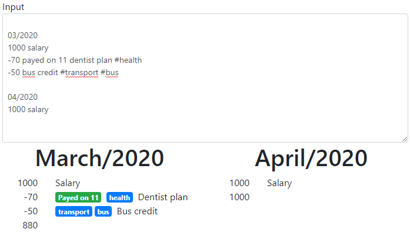

# financial-viewer

A financial viewer to plan monthly. Edit the input textarea and see it rendered.

Example  

## Patterns

### 2 numbers/4 numbers to start a new block (month/year)

Example: 03/2020 for March/2020.

### Start with positive or negative number to create a payment line

Example: 1000 salary (after the number it will be the description).

If you want to add a tag of `payed on` or `received on`, you just have to put the code `payed on` as well `received on` after the number and before the description followed by the date (of the current block month).

If you want to add some tags, you just have to put the tags after the description with a `#` on the start of each one.
